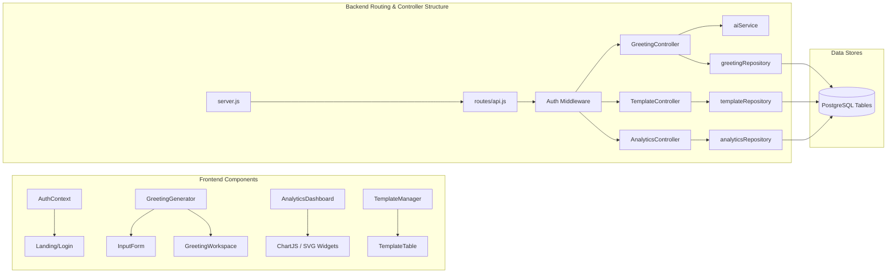
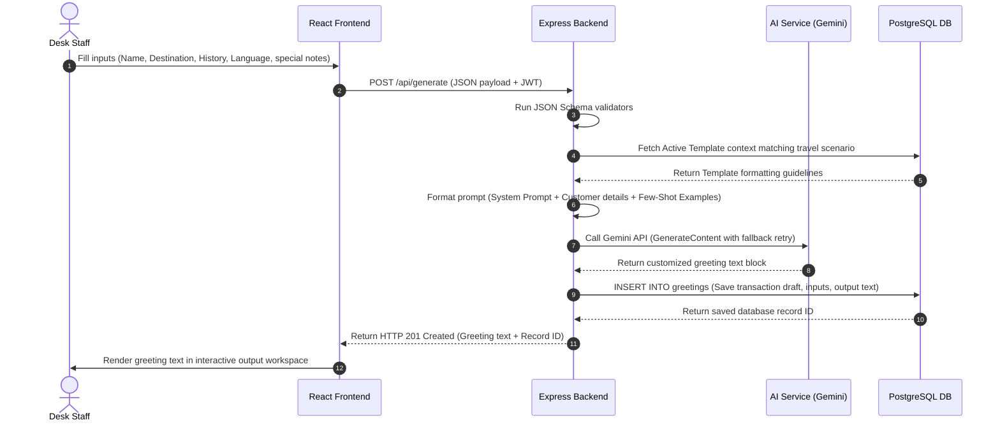

# Phase 2: System Design Document
## AI Customer Greeting Personalizer - Manivtha Tours & Travels

---

### 1. High-Level Architecture Diagram

The system employs a classic **3-Tier Architecture** separated into Client Layer (Presentation), API Server Layer (Business Logic), and Database/LLM Layer (Data Persistence & AI Services).

```mermaid
graph TD
    subgraph Client Layer (React SPA)
        A[Web Browser / Staff User] -->|HTTPS Requests| B[React Frontend Client]
    end

    subgraph API Server Layer (Node.js & Express)
        B -->|REST APIs + JWT Bearer Token| C[Express Router]
        C -->|Session Validate| D[Auth Middleware]
        D -->|Incoming Data Sanitize| E[Input Validator]
        E -->|Business Operations| F[Controllers & Services]
    end

    subgraph Persistence & AI Services
        F -->|SQL Queries| G[(Supabase PostgreSQL)]
        F -->|GenAI Prompt Payloads| H[Google Gemini API / OpenAI API]
        F -->|Local Logging| I[Winston Logger Files]
    end
```

---

### 2. Low-Level Architecture Diagram



---

### 3. Frontend Architecture
The Frontend is built as a single-page application (SPA) using **React (Vite)**. The architecture separates layouts, components, views, services, state contexts, and utility modules.
* **Vite**: Rapid hot module replacement (HMR) and optimized rollup production bundles.
* **React Router Dom**: Dynamic client-side routing, protected auth guards, and redirection logic.
* **Tailwind CSS**: Utility-first CSS using a custom design system token palette.
* **Context API**: Global state management to coordinate authentication states, current templates list, active greetings, and dashboard configurations.
* **Axios Service Instance**: Configured with interceptors to automatically attach the JWT token from `localStorage` to the request headers and intercept expired token errors (HTTP 401).

---

### 4. Backend Architecture
The backend is built on **Node.js** using the **Express.js** framework. It adheres to **Clean Architecture** and **SOLID Principles**:
* **Single Responsibility**: Route handlers, controllers, validators, and database repositories are decoupled.
* **Dependency Inversion**: Services depend on abstract interfaces (like the database adapter) rather than specific SQL clients, allowing easy fallback to mock JSON storage.
* **Middlewares**:
  - `cors`: Cross-Origin Resource Sharing restrictions.
  - `helmet`: Enhances HTTP headers to protect against common attacks.
  - `express-rate-limit`: Prevents API flooding and brute force attempts.
  - `authMiddleware`: Extracts the `Authorization: Bearer <token>` header, verifies the signature, and attaches the user payload to `req.user`.

---

### 5. AI Workflow Diagram



---

### 6. Database Architecture (ER Diagram)

The database design is normalized to 3NF, utilizing foreign keys, strict check constraints, and performance-optimizing indexes.

```
                  +-------------------+
                  |       USERS       |
                  +-------------------+
                  | id (PK, UUID)     |
                  | username (Unique) |
                  | password_hash     |
                  | role (enum)       |
                  | created_at        |
                  +---------+---------+
                            |
                            | 1:N
                            v
+---------------------------+---------------------------+
|                         GREETINGS                     |
+-------------------------------------------------------+
| id (PK, UUID)                                         |
| user_id (FK -> USERS.id)                              |
| customer_name (VARCHAR)                               |
| destination (VARCHAR)                                 |
| travel_date (DATE)                                    |
| booking_history (VARCHAR)                             |
| travel_type (VARCHAR)                                 |
| language (VARCHAR)                                    |
| category (VARCHAR)                                    |
| special_notes (TEXT)                                  |
| generated_text (TEXT)                                 |
| status (draft / shared)                               |
| created_at (TIMESTAMP)                                |
+---------------------------+---------------------------+
                            |
                            | 1:1
                            v
                  +-------------------+
                  |     FEEDBACK      |
                  +-------------------+
                  | id (PK, UUID)     |
                  | greeting_id (FK)  |
                  | rating (INT, 1-5) |
                  | comments (TEXT)   |
                  | created_at        |
                  +-------------------+
```

Additional Tables:
* **`templates`**: Core templates configurations managed by admins.
* **`analytics`**: Cached metric snapshots (Total Greetings, Daily Counts, Ratings average).
* **`admin_logs`**: System audit log recording security incidents, template deletions, and configuration changes.

---

### 7. Deployment Architecture

```
                                  +-------------------+
                                  |   Vercel Edge     |
                                  | (React Client SPA)|
                                  +---------+---------+
                                            |
                                            | HTTPS REST Request
                                            v
                                  +-------------------+
                                  |    Render.com     |
                                  | (Express Backend) |
                                  +---------+---------+
                                            |
                                  +---------+---------+
                                  |                   |
                                  v                   v
                        +-------------------+  +---------------+
                        | Supabase Cloud SQL|  | Google Gemini |
                        | (PostgreSQL DB)   |  | API Platform  |
                        +-------------------+  +---------------+
```

---

### 8. End-to-End Data Flow

1. **User Action**: The desk staff fills out the client detail form on the React portal.
2. **Frontend Dispatch**: The frontend validates input constraints locally, packages inputs into a JSON payload, and posts to `/api/generate` with a JWT authentication header.
3. **Backend Middleware**: The server verifies token authenticity, logs the request IP, runs input sanitization (XSS filtering), and routes to `GreetingController`.
4. **AI Generation & Save**: The backend retrieves prompt structures, passes the formatted payload to Google Gemini API, receives the response, parses the formatting, and writes the details to the `greetings` PostgreSQL table.
5. **UI Return**: The server returns the greeting block. The frontend stores it in its active state context and displays it in a responsive text area.
6. **Action Logging**: The staff reviews the draft, clicks copy/share, and rates the generation quality. Feedback is sent back via `/api/feedback` to populate analytics charts.
